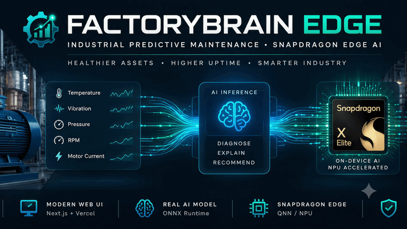
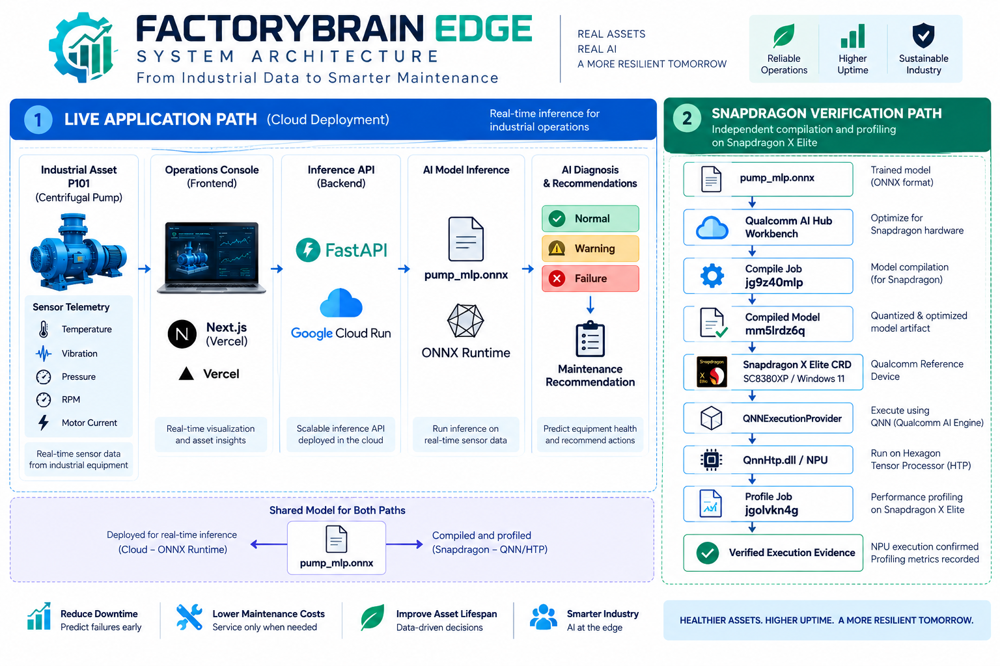

# ⚙️ FactoryBrain Edge

<p align="center">
  <strong>Industrial Predictive Maintenance powered by AI — with verified Snapdragon X Elite NPU profiling evidence.</strong>
</p>

<p align="center">
  <a href="https://factory-brain-edge.vercel.app"><strong>🚀 Live Demo</strong></a>
  &nbsp;&nbsp;•&nbsp;&nbsp;
  <a href="https://factory-brain-edge.vercel.app/runtime"><strong>⚡ Snapdragon Evidence</strong></a>
  &nbsp;&nbsp;•&nbsp;&nbsp;
  <a href="#-system-architecture"><strong>🏗️ Architecture</strong></a>
</p>

---

## 💡 What is FactoryBrain Edge?

FactoryBrain Edge is an industrial predictive-maintenance application that turns equipment telemetry into AI-assisted equipment-health diagnosis and maintenance recommendations.

The demonstration monitors a process pump using five telemetry signals:

- 🌡️ Temperature
- 📈 Vibration
- ⏱️ Pressure
- ⚙️ RPM
- ⚡ Motor Current

The trained model is exported as `pump_mlp.onnx` and used by the live application through ONNX Runtime.

A separate copy of the same model artifact was compiled and profiled through Qualcomm AI Hub Workbench for a **Snapdragon X Elite CRD**, providing evidence of execution through Qualcomm's QNN stack and NPU/HTP path.

---

## 🏗️ System Architecture

<p align="center">
  
</p>

The architecture deliberately separates two execution contexts:

**☁️ Live Application Path** — The public FactoryBrain application uses a Next.js frontend deployed on Vercel and a FastAPI inference service deployed on Google Cloud Run. The backend performs inference with the `pump_mlp.onnx` model through ONNX Runtime.

**⚡ Snapdragon Verification Path** — The same ONNX model artifact was independently compiled and profiled through Qualcomm AI Hub Workbench for the Snapdragon X Elite CRD. The recorded profiling path uses `QNNExecutionProvider` with the HTP backend/NPU.

---
## ⚡ Snapdragon NPU Execution Evidence

<p align="center">
  <strong>
    FactoryBrain's ONNX model was compiled and profiled for a Snapdragon X Elite CRD through Qualcomm AI Hub Workbench.
  </strong>
</p>

<p align="center">
  <a href="https://factory-brain-edge.vercel.app/runtime">
    <strong>⚡ View Live Snapdragon Evidence →</strong>
  </a>
</p>

### 🔗 Verified Model Pipeline

<p align="center">

**`pump_mlp.onnx`**  
⬇️  
☁️ **Qualcomm AI Hub Workbench**  
⬇️  
⚙️ **Compile Job `jg9z40mlp`**  
⬇️  
📦 **Compiled Model `mm5lrdz6q`**  
⬇️  
💻 **Snapdragon X Elite CRD**  
⬇️  
🧠 **QNNExecutionProvider**  
⬇️  
⚡ **HTP / NPU**  
⬇️  
📊 **Profile Job `jgolvkn4g`**  
⬇️  
✅ **VERIFIED EXECUTION EVIDENCE**

</p>

---

### 🧾 Qualcomm AI Hub Evidence

| Evidence | Verified Value |
|---|---|
| 🧠 Model | `pump_mlp.onnx` |
| ⚙️ Compile Job | `jg9z40mlp` |
| 📦 Compiled Model | `mm5lrdz6q` |
| 📊 Profile Job | `jgolvkn4g` |
| 💻 Target Device | Snapdragon X Elite CRD |
| 🧩 Chipset | SC8380XP |
| 🪟 Operating System | Windows 11 |
| ⚡ Compute Unit | NPU |
| 🧠 Execution Provider | `QNNExecutionProvider` |
| ⚙️ HTP Backend | `QnnHtp.dll` |
| 🔁 Profile Iterations | 100 |
| ⏱️ Recorded Profile Inference Time | 32 µs |
| 💾 Peak Inference Memory | 1 MB |
| 🔧 Runtime | ONNX Runtime 1.27.1 |
| 📥 Model Input | `telemetry` |
| 📐 Input Shape | `[1, 5]` |
| ✅ Status | **VERIFIED** |

---

### 🔐 Evidence Chain

The model identity and Qualcomm AI Hub job identifiers are preserved by FactoryBrain Edge so that the Snapdragon-targeted workflow can be traced from compilation through profiling:

```text
pump_mlp.onnx
      │
      ▼
Compile Job
jg9z40mlp
      │
      ▼
Compiled Model
mm5lrdz6q
      │
      ▼
Snapdragon X Elite CRD
SC8380XP
      │
      ▼
QNNExecutionProvider
      │
      ▼
QnnHtp.dll / NPU
      │
      ▼
Profile Job
jgolvkn4g
      │
      ▼
VERIFIED
```
## 🛠️ Technology Stack

<p align="center">


</p>

<p align="center">


</p>

### 🧩 Components

| Layer | Technology | Purpose |
|---|---|---|
| 🖥️ Operations Console | Next.js | Interactive industrial telemetry and diagnosis UI |
| 🌐 Frontend Hosting | Vercel | Public FactoryBrain web application |
| ⚡ Inference API | FastAPI | Receives telemetry and serves AI inference |
| 🐍 Backend Runtime | Python | Model serving and application logic |
| 🧠 AI Artifact | `pump_mlp.onnx` | Predictive-maintenance model |
| 🔄 Model Runtime | ONNX Runtime | Live cloud inference |
| ☁️ Backend Hosting | Google Cloud Run | Production FastAPI deployment |
| 🏗️ CI Build | Google Cloud Build | Container build pipeline |
| 📦 Container Registry | Artifact Registry | Backend container image storage |
| 🧪 Edge Verification | Qualcomm AI Hub Workbench | Snapdragon compilation and profiling |
| 💻 Edge Target | Snapdragon X Elite CRD | Qualcomm reference target |
| ⚡ Edge Compute | QNN / HTP / NPU | Snapdragon profiling execution path |

---

## 🚀 Live Demo

### Industrial AI Operations Console

👉 **https://factory-brain-edge.vercel.app**

The public console provides interactive telemetry controls for the FactoryBrain demonstration asset, **Process Pump P101**.

Users can modify:

`Temperature` • `Vibration` • `Pressure` • `RPM` • `Motor Current`

and send those values to the deployed inference API.

### 🎮 Demo Flow

```text
Choose / adjust telemetry
          │
          ▼
    Run AI Diagnosis
          │
          ▼
     FastAPI Backend
          │
          ▼
     pump_mlp.onnx
          │
          ▼
      ONNX Runtime
          │
          ▼
 Equipment Diagnosis
          │
          ▼
Confidence + Class Probabilities
          │
          ▼
Recommended Maintenance Action
```

---

## 🌐 Production Deployment
FactoryBrain Edge uses a split production architecture: the public Next.js frontend is deployed on **Vercel**, while the production FastAPI inference backend is deployed on **Google Cloud**.

### ☁️ Google Cloud Backend

```text
GitHub Repository
       │
       ▼
Google Cloud Build
       │
       ▼
Artifact Registry
       │
       ▼
Google Cloud Run
       │
       ▼
FastAPI Inference API
       │
       ▼
ONNX Runtime
       │
       ▼
pump_mlp.onnx
```

| Service | FactoryBrain Edge Usage |
|---|---|
| 🏗️ Google Cloud Build | Builds the backend container from GitHub source |
| 📦 Artifact Registry | Stores the backend container image |
| 🚀 Google Cloud Run | Hosts the production FastAPI inference API |
| 🧠 ONNX Runtime | Executes the predictive-maintenance model |

**Google Cloud Project:** `factorybrain-edge`  
**Region:** `asia-south1`  
**Cloud Run Service:** `factorybrain-edge`

### 🔌 Production Backend API

https://factorybrain-edge-751411693796.asia-south1.run.app

### ⚡ Snapdragon Evidence API

https://factorybrain-edge-751411693796.asia-south1.run.app/runtime/snapdragon

> **Deployment clarification:** Vercel hosts the public user interface. Google Cloud Run hosts the live inference backend. Qualcomm AI Hub Workbench separately provides the Snapdragon X Elite compilation and NPU profiling evidence.

---

## 💻 Run Locally

### Prerequisites

Before running FactoryBrain Edge locally, install:

- Python 3.11+
- Node.js / npm
- Git

Clone the repository:

```bash
git clone https://github.com/Janicebenita/FactoryBrain-Edge.git
cd FactoryBrain-Edge
```

### ⚡ Start the Backend

```powershell
cd backend
.\.venv\Scripts\Activate.ps1
python -m uvicorn main:app --reload --port 8000
```

The local FastAPI service will be available at:

```text
http://127.0.0.1:8000
```

### 🖥️ Start the Frontend

Open another terminal:

```powershell
cd frontend
npm install
npm run dev
```

Create or update:

```text
frontend/.env.local
```

For local backend development:

```env
NEXT_PUBLIC_API_URL=http://127.0.0.1:8000
```

Or point the local frontend to the production API:

```env
NEXT_PUBLIC_API_URL=https://factorybrain-edge-751411693796.asia-south1.run.app
```

Open:

```text
http://localhost:3000
```

---

## 📁 Repository Structure

```text
FactoryBrain-Edge/
│
├── backend/
│   ├── main.py
│   ├── snapdragon_evidence.py
│   ├── requirements.txt
│   ├── Dockerfile
│   │
│   └── models/
│       ├── pump_mlp.onnx
│       └── snapdragon_execution.json
│
├── frontend/
│   ├── app/
│   │   ├── page.tsx
│   │   └── runtime/
│   │       └── page.tsx
│   │
│   └── .env.local
│
├── docs/
│   └── assets/
│       ├── factorybrain-edge-banner.gif
│       └── factorybrain-architecture.png
│
└── README.md
```

> Local virtual environments, build output, secrets, and `.env.local` should not be committed to the repository.

---

## 🎬 Hackathon Demo Flow

FactoryBrain Edge is designed so the core application and Snapdragon evidence can be demonstrated in a few minutes.

### 1️⃣ Open the Operations Console

👉 https://factory-brain-edge.vercel.app

Introduce **Process Pump P101** and the five telemetry inputs:

**Temperature • Vibration • Pressure • RPM • Motor Current**

### 2️⃣ Demonstrate Normal Operation

Click:

**Load Normal Sample → Run AI Diagnosis**

Explain that the telemetry is sent to the deployed FastAPI backend, where the ONNX model performs the diagnosis.

### 3️⃣ Demonstrate a Warning Condition

Click:

**Load Warning Sample → Run AI Diagnosis**

Show the resulting diagnosis, confidence, class probabilities, and recommended maintenance action.

### 4️⃣ Open Snapdragon Evidence

Click:

**Snapdragon Runtime →**

or open:

👉 https://factory-brain-edge.vercel.app/runtime

Show:

- Snapdragon X Elite CRD
- SC8380XP
- NPU
- Compile Job `jg9z40mlp`
- Compiled Model `mm5lrdz6q`
- Profile Job `jgolvkn4g`
- `QNNExecutionProvider`
- `QnnHtp.dll`
- profiling metrics
- verification status

### 5️⃣ Explain the Two Execution Contexts

```text
LIVE APPLICATION
Telemetry
   ↓
Vercel / Next.js
   ↓
Google Cloud Run / FastAPI
   ↓
ONNX Runtime
   ↓
AI Diagnosis


SNAPDRAGON VERIFICATION
pump_mlp.onnx
   ↓
Qualcomm AI Hub Workbench
   ↓
Compile
   ↓
Snapdragon X Elite CRD
   ↓
QNN / HTP / NPU
   ↓
Profile
   ↓
Verified Evidence
```

This distinction makes the deployment architecture transparent: the public application is cloud hosted, while the Qualcomm workflow provides separate Snapdragon-targeted compilation and profiling evidence for the model artifact.

---

## 🏆 Hackathon Evidence

FactoryBrain Edge was prepared for the **Qualcomm Snapdragon AI Lab Build & Present Challenge**.

The project demonstrates four connected areas:

| Area | FactoryBrain Edge Implementation |
|---|---|
| 🧠 AI Application | Predictive-maintenance diagnosis from industrial telemetry |
| ⚙️ Technical Implementation | Next.js + FastAPI + ONNX Runtime application |
| ⚡ Snapdragon Workflow | Qualcomm AI Hub compilation and profiling |
| 🌐 Deployment | Public Vercel frontend + Google Cloud Run backend |
| 📊 Evidence | Dedicated `/runtime` dashboard and evidence API |
| 🏭 Use Case | Early identification of industrial equipment-health conditions |

### 🔍 Reproducible Evidence IDs

```text
Model
pump_mlp.onnx

Compile Job
jg9z40mlp

Compiled Model
mm5lrdz6q

Profile Job
jgolvkn4g

Target
Snapdragon X Elite CRD

Chipset
SC8380XP

Execution Provider
QNNExecutionProvider

HTP Backend
QnnHtp.dll
```

These identifiers connect the FactoryBrain model artifact to the recorded Qualcomm AI Hub compilation and profiling workflow.

---

## ⚠️ Scope & Limitations

FactoryBrain Edge is a predictive-maintenance **demonstration system**, not a production industrial safety controller.

The current demonstration uses a Process Pump P101 scenario and five telemetry features. Model outputs should therefore be interpreted as demonstration predictions rather than certified equipment-health assessments.

The public application performs inference using ONNX Runtime on the cloud-hosted FastAPI backend.

The Snapdragon X Elite information presented by FactoryBrain comes from the separately recorded Qualcomm AI Hub Workbench compilation and profiling workflow. It should **not** be interpreted as a claim that requests to the public Vercel or Cloud Run deployment are themselves executing on a Snapdragon NPU.

Profiling measurements are reported as recorded by the profiling workflow and should not be generalized into universal latency, throughput, power, or production-performance guarantees.

---

## 🔗 Quick Links

| Resource | Link |
|---|---|
| 🚀 FactoryBrain Edge | https://factory-brain-edge.vercel.app |
| ⚡ Snapdragon Evidence | https://factory-brain-edge.vercel.app/runtime |
| 🔌 Evidence API | https://factorybrain-edge-751411693796.asia-south1.run.app/runtime/snapdragon |
| 💻 Source Repository | https://github.com/Janicebenita/FactoryBrain-Edge |

---

## ✅ Project Status

```text
AI Model                    ✅
ONNX Inference              ✅
Interactive Telemetry       ✅
FastAPI Backend             ✅
Next.js Operations Console  ✅
Google Cloud Run            ✅
Vercel Production           ✅
Qualcomm AI Hub Compile     ✅
Snapdragon X Elite Profile  ✅
QNN / HTP Evidence          ✅
NPU Execution Evidence      ✅
Public Evidence Dashboard   ✅
```

<p align="center">
  <strong>⚙️ FACTORYBRAIN EDGE</strong>
</p>

<p align="center">
  Predict earlier • Maintain smarter • Build for the edge
</p>

<p align="center">
  <a href="https://factory-brain-edge.vercel.app">
    <strong>🚀 Launch FactoryBrain Edge</strong>
  </a>
  &nbsp;&nbsp;•&nbsp;&nbsp;
  <a href="https://factory-brain-edge.vercel.app/runtime">
    <strong>⚡ View Snapdragon Evidence</strong>
  </a>
</p>
